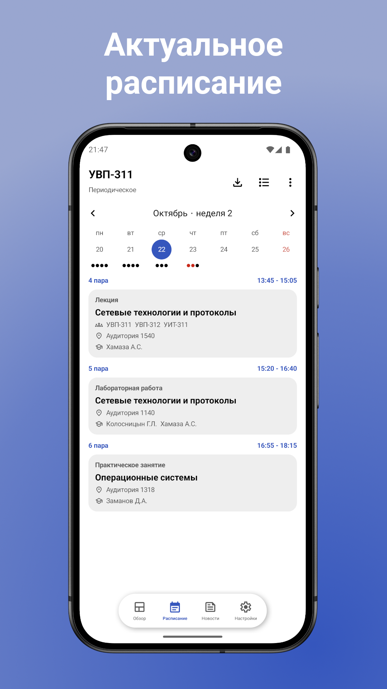
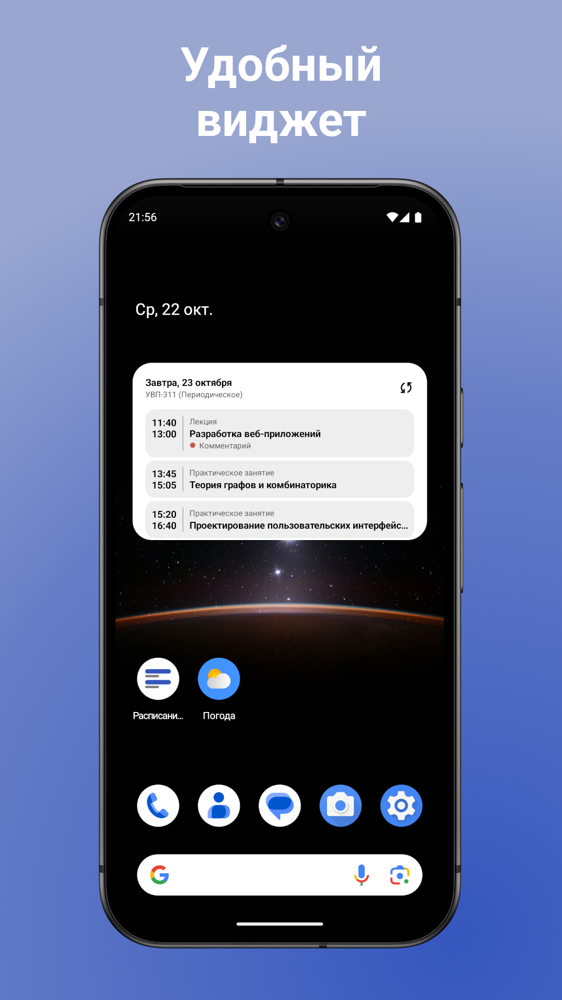

# Расписание МИИТ

Приложение для поиска и сохранения расписаний РУТ(МИИТ). 

Здесь уже можно:
- Сохранять расписания групп, преподавателей и аудиторий
- Добавлять комментарии и теги к парам
- Просматривать новости университета
- Выбирать стиль оформления приложения

## Скриншоты
<table>
<tr>
<td></td>
<td></td>
<td></td>
<td></td>
</tr>
</table>
